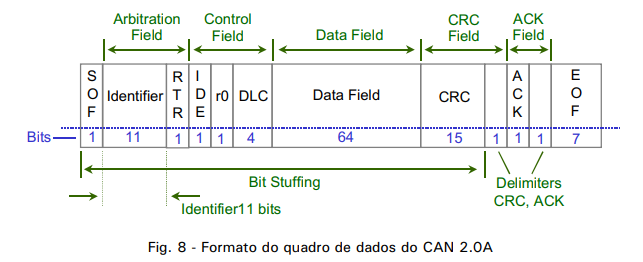
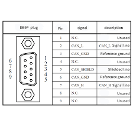
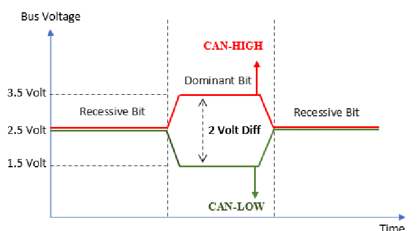
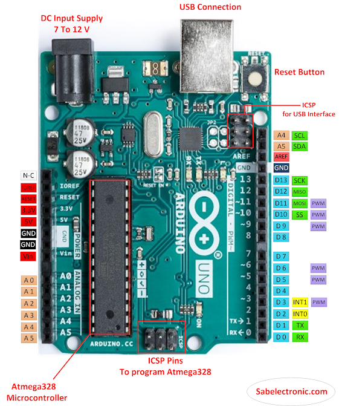
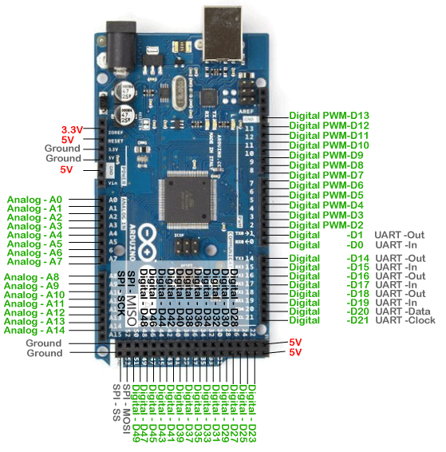

# Protocolo Controlador de Área (CAN)

## Visão Geral

Bem-vindo ao ao meu repositório pessoal que tem como objeto de estudo o Protocolo Controlador de Área (CAN). Este documento fornece uma breve introdução e visão geral do protocolo CAN, detalhando seu propósito, características e aplicações.

## Sumário

1. [Introdução](#introdução)
2. [Características Principais](#características-principais)
3. [Aplicações](#aplicações)
4. [Fundamentos da Comunicação](#fundamentos-da-comunicação)
5. [Implementações](#implementações)
6. [Primeiros Passos](#primeiros-passos)
7. [Contribuições](#contribuições)

## Introdução

O Controlador de Área (CAN) é um protocolo de comunicação robusto e amplamente utilizado, projetado para a troca de dados em tempo real e alta integridade entre unidades de controle eletrônico (ECUs) em diversos sistemas embarcados. Desenvolvido originalmente pela Bosch, o CAN tornou-se um padrão em aplicações automotivas e industriais.

## Características Principais

- **Confiabilidade:** O CAN é conhecido por sua alta confiabilidade, tornando-o adequado para aplicações críticas onde a integridade dos dados é crucial.

- **Comunicação Determinística:** O CAN oferece comunicação determinística, garantindo que as mensagens sejam transmitidas de maneira previsível e com baixa latência.

- **Sistema Multi-Mestre:** O CAN suporta uma arquitetura multi-mestre, permitindo que vários nós transmitam mensagens na rede sem controle central.

- **Tolerância a Falhas:** O CAN é projetado para ser tolerante a falhas, com recursos como detecção de erros e retransmissão automática de mensagens corrompidas.

- **Escalabilidade:** O protocolo é escalável, sendo aplicável a uma ampla gama de sistemas, desde redes simples até sistemas distribuídos complexos.

Uma característica importante sobre a utilização do protocolo CAN em projetos é o tamanho dos dados que é possível ser transmitido (8 Bytes por mensagem) e a velocidade máxima de transmissão de 1 Mbits/s. O sistema também possui priorização de mensagens, proporcionando um controle refinado sobre a ordem de transmissão e recebimento.

## Aplicações

O CAN é comumente usado em:

- **Sistemas Automotivos:** Utilizado para comunicação entre várias ECUs em veículos modernos, como unidades de controle do motor, sistemas de airbag e sistemas antibloqueio de freios.

- **Automação Industrial:** Aplicado em ambientes industriais para comunicação entre controladores lógicos programáveis (PLCs) e outros dispositivos de controle.

- **Dispositivos Médicos:** Presente em equipamentos médicos para comunicação entre diferentes subsistemas.

- **Aeroespacial:** Utilizado em sistemas avionicos para comunicação entre vários componentes de uma aeronave.

## Fundamentos da Comunicação

O CAN utiliza um barramento diferencial de dois fios para comunicação:

- **CAN High (CAN_H):** Transporta sinais de alta voltagem.
- **CAN Low (CAN_L):** Transporta sinais de baixa voltagem.

As mensagens são transmitidas em um formato de quadro que inclui um identificador, dados e informações de controle. Existem duas versões do protocolo CAN, denominadas CAN 1.0 e CAN 2.0, sendo que a 2.0 é subdividida em CAN 2.0A e CAN 2.0B.

As versões 1.0 e 2.0A possuem identificadores de 11 bits, enquanto a versão 2.0B utiliza identificadores de 29 bits. A última pode ser configurada para operar de forma passiva ou ativa. Na configuração passiva, ela ignora todas as tramas do tipo estendido (29 bits), enquanto na configuração ativa, recebe qualquer mensagem estendida.

**Quadro Padrão CAN 2.0A:**

1. **SOF (Start of Frame) Field (Campo de Início de Quadro):** Composto por um bit dominante que indica o início do quadro, é utilizado para sincronizar os nos sob o barramento após ele estar ocioso.

2. **Arbitration Field (Campo de Arbitragem):** Relacionado ao processo de arbitragem. Contém o identificador e um bit denominado RTR (Remote Transmission Request). Se o RTR for 0, o quadro é do tipo quadro de dados; se for 1, indica que o quadro é do tipo quadro remoto, também está contido o identificador que fornece a informação de prioridade da mensagem - quanto mais proximo de 0 mais prioritária é a mensagem.

3. **Control Field (Campo de Controle):** Contém 6 bits de controle. O primeiro bit é o IDE (Identifier Extended Bit), que sinaliza se o quadro é padrão (dominante) ou estendido (recessivo). O bit seguinte, r0, é reservado para novas aplicações em futuras versões do CAN. Os quatro últimos bits formam o conjunto DLC (Data Length Code), que indica o número de bytes no campo de dados.

4. **Data Field (Campo de Dados):** Contém 8 bytes (64 bits) com o bit mais significativo do primeiro byte de dados sendo transmitido primeiro. Os bytes podem representar diversas informações, uma informação ou partes de uma informação.

5. **CRC (Cyclic Redundance Check) Field (Campo de Verificação de Redundância Cíclica):** Possui 15 bits utilizados para a implementação do código de detecção de erros e um bit recessivo delimitador deste campo. O código é calculado de acordo com um polinômio específico definido para o CAN, utilizando os 4 primeiros campos do quadro de dados (SOF, Arbitration Field, Control Field e Data Field) para o cálculo.

6. **ACK (Acknowledge) Field (Campo de Confirmação):** Consiste em dois bits, um bit denominado ACK, recessivo, que é sobrescrito por bits dominantes transmitidos por outro nó que recebe a mensagem com sucesso.

7. **EOF (End of Frame) Field (Campo de Fim de Quadro):** Possui 7 bits recessivos, indicando o fim do quadro.

8. **IFS:** Contém a quantidade de tempo requerido pelo controlador CAN para mover um frame corretamente recebido para a própria posição dele em uma área de armazenamento de mensagens.

## Conectores 

A CiA (CAN in Automation) recomenda a utilização de um conector padronizado de nove pinos para a conexão dos nós ao barramento.

## Signal CAN+ CAN-

A rede CAN transmite o sinal dominante aplicando 3,5V no pin CAN+ e 1,25V no pin CAN-, para o sinal recessivo é aplicado 2,5V em ambos os canais.

## Implementações

Existem diferentes versões do CAN, incluindo o CAN Clássico e o CAN FD (Taxa de Dados Flexível), cada um com suas especificações. Vários microcontroladores e circuitos integrados de transceptor suportam o CAN, proporcionando flexibilidade para diferentes aplicações. Para esse repositório será utilizado as placas de prototipagem Arduino para verificar os funcionamentos básicos da comunicação através do CAN.

## Primeiros Passos

Caso queira acompanhar os códigos apresentados aqui você precisará de um Arduino e um controlador CAN MCP2515, além de uma interface de programação de sua preferência.

Para o funcionamento adequado da rede é necessário fazer a sincronização dos dispositivos mestre e escravo (lembrando que na rede CAN pode haver mais de um dispositivo enviando dados, como também mais de um recebendo dados), para isso é utilizado os pinos CS e SCK, sendo o primeiro para comunicação direta do mestre com o escravo e o segundo o pino de clock. Os pino SI são para recepção de dados e o SO para saída de dados.

Para realizar a comunicação via protocolo CAN no Arduino Uno será utilizado os pinos 13, 12, 11 e 10, que correspondem respectivamente ao SCK, MISO, MOSI e SS.

## Conexão entre MCP2515 e Arduino Uno

| MCP2515  | Arduino Uno  |
|----------|--------------|
| SCK      | pin 13       |
| MOSI     | pin 11       |
| MISO     | pin 12       |
| CS       | pin 10       |

Para realizar a comunicação via protocolo CAN no Arduino Mega será utilizado os pinos 50, 51, 52 e 53, que correspondem respectivamente ao MISO, MOSI, SCK e SS.

| MCP2515  | Arduino Mega |
|----------|--------------|
| SCK      | pin 52       |
| MOSI     | pin 51       |
| MISO     | pin 50       |
| CS       | pin 53       |

## Contribuições

Contribuições para esta documentação são bem-vindas. Se você tiver insights, correções ou informações adicionais para compartilhar, por favor, faça um pull request.
